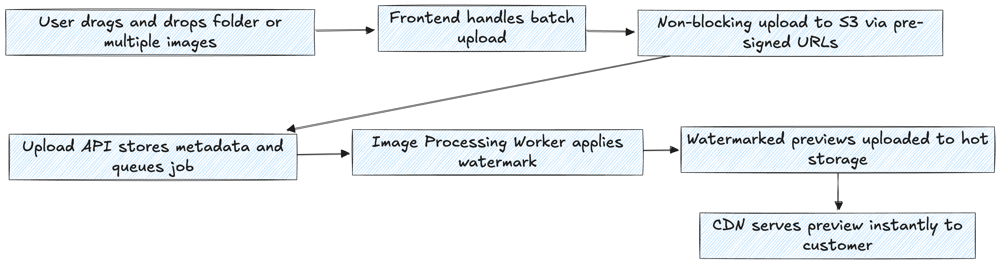
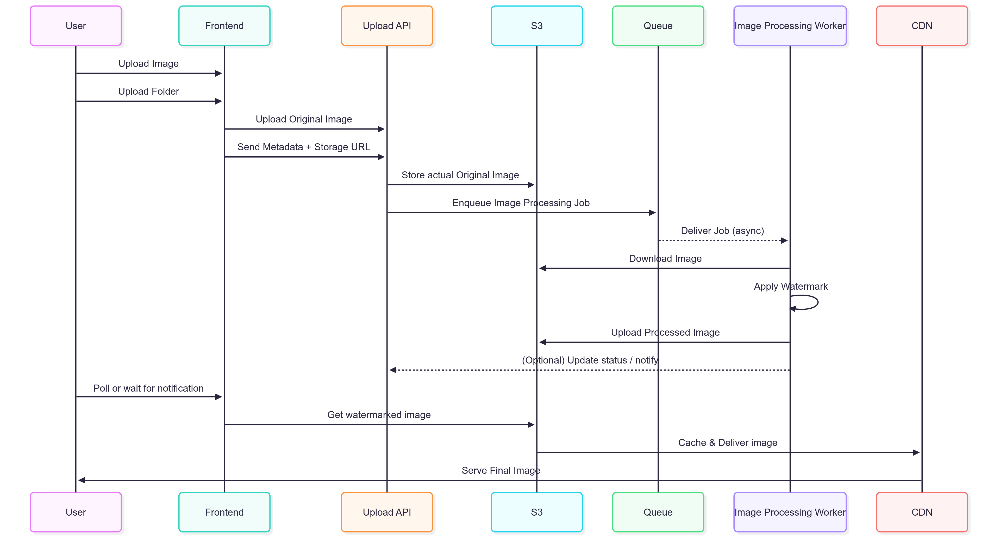

# ⚛️ Image Upload & Watermark Processing Pipeline RFC

This RFC proposes the architecture for a reliable, scalable image upload and watermarking pipeline designed for a SaaS platform that enables photographers to sell protected previews of their work. The system supports high-resolution image uploads, automatic watermarking, metadata storage, and delivery through a CDN.

## Summary

- [Problem description](#Problem-description)
- [Personas](#Personas)
- [Usability](#Usability)
- [Architecture Overview](#Architecture-Overview)
- [Codebase](#codebase)
- [Security](#security)
- [Legal](./LEGAL.md)

## Problem description

Photographers need a way to sell digital images online without exposing full-resolution files before purchase. The current manual workflow for uploading, watermarking, and delivering images is time-consuming, error-prone, and does not scale well.

This system should:

- Automatically apply watermarks to previews.

- Deliver original files securely after payment.

- Organize images by album/theme.

- Minimize manual effort and storage costs.

## Personas

- *Photographer*
- *Customer*
- *System Admin*

 

- The *Photographer* wants to upload high-res photos, organize them, and have previews protected. Prefers automation and wants a professional storefront experience.
- The *Customer* wants to browse and preview photos before buying, pay quickly (via Pix), and get instant access to purchased files.
- The *System Admin* will maintain and monitor the system for performance, cost, and abuse.

## Usability

Uploads should support batch/folder drag-and-drop.

Customers should receive watermarked previews after processing.

Purchased photos should be emailed securely with temporary download links.

The system should scale without degrading UX.

### Architecture Overview

| Components | Tech                                             |
|------------|--------------------------------------------------|
| Frontend   | React (with shadcn/ui)                           |
| API        | Bun w/ [Elysia](https://elysiajs.com/), Supabase |
| Storage    | [BackBlaze](https://www.backblaze.com/)          |
| Queue      | RabbitMQ                                         |
| Worker     | Bun, ImageMagick                                 |
| CDN        | Cloudflare (custom hosts, caching)               |
| Email      | Resend                                           |
| Pix        | Woovi?                                           |

- Frontend: Built using React with shadcn/ui for a consistent and customizable UI design system.

- API: Powered by Bun with the Elysia framework and uses Supabase for backend services like authentication and database.

- Storage: Files are stored securely on Backblaze (S3 compatible), ensuring scalability.

- Queue: Asynchronous processing is handled using RabbitMQ to manage workloads efficiently.

- Worker: Bun and ImageMagick handle background tasks like image processing.

- CDN: Cloudflare provides a fast and secure content delivery network with custom host support and caching.

- Email: Transactional and system emails are sent via Resend.

## Codebase

Bun's package manager supports npm "workspaces" This allows us to split a codebase into multiple distinct "packages" that live in the same repository, can depend on each other, and (when possible) share a node_modules directory.

> [!NOTE]
> Bun supports the "workspace:*" syntax.

## Security

Signed URLs are used for secure uploads and downloads, ensuring original images are never exposed publicly.
Previews are protected with watermarks to prevent misuse.
Role-based access control (RBAC) is enforced on API endpoints to restrict access based on user permissions.

